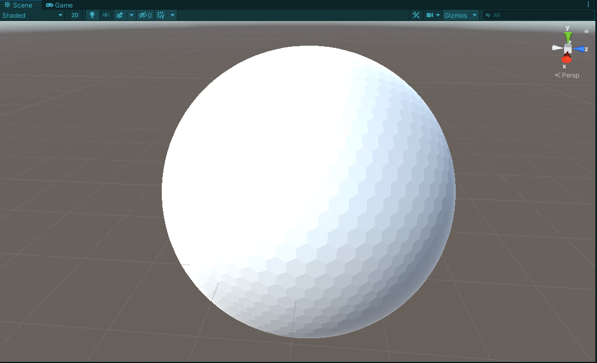
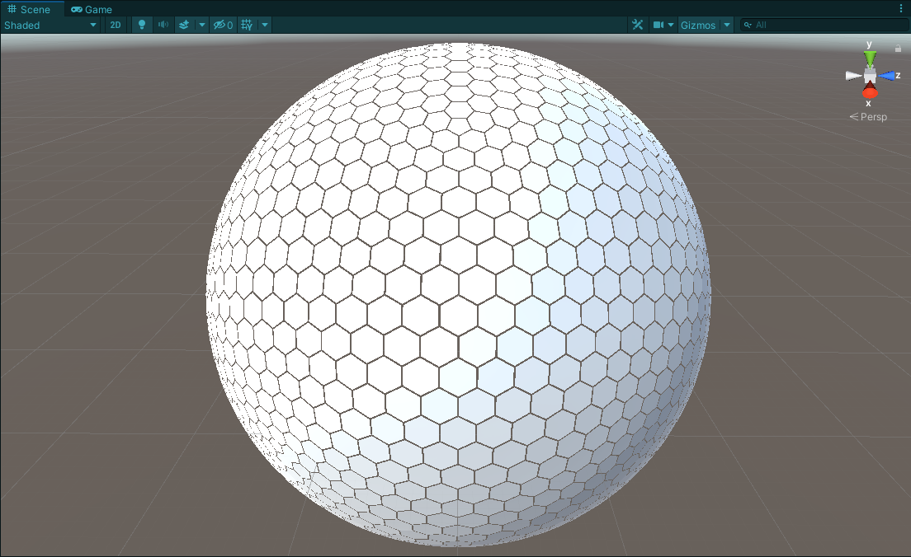

Hexasphere
=============
This is a Unity c# port of [Hexasphere.js](https://github.com/arscan/hexasphere.js).

This code can be used to construct a [geodesic polyhedron](https://en.wikipedia.org/wiki/Geodesic_polyhedron), with faces grouped into hexagons and pentagons. Since there is no way to mathematically group hexagons into a sphere shape, the next best thing is to have 12 pentagons and then an arbitrary number of hexagons (depending on the desired division count).




Usage
---------

Create an empty GameObject in a scene. After that either attach the `DrawHexasphere` script to it, or make your own implementation. For example:

```c#
private void Start()
{
    //Make sure the GameObject this is attached to has a MeshFilter and MeshRenderer components!
    MeshFilter meshFilter = GetComponent<MeshFilter>();
    //Size of final sphere
    float radius = 100f;
    //Amount of divisions to the original icosahedron. More divisions = more hexagons and slower execution
    int divisions = 10;
    //Size of individual hexagons, values between 0.01f and 1f. Anything smaller than 1f will leave gaps between each hex.
    float hexSize = 0.7f;
    
    Hexasphere hexasphere = new Hexasphere(radius, divisions, hexSize);

    Mesh mesh = new Mesh();
    meshFilter.mesh = mesh;
    mesh.vertices = _hexasphere.MeshDetails.Vertices.ToArray();
    mesh.triangles = _hexasphere.MeshDetails.Triangles.ToArray();
    mesh.RecalculateNormals();
    

    hexasphere.tiles.ForEach(tile => 
    {
        //tile.Points contains all the points for the given tile
        //tile.Faces contains all the faces for the given tile
        //tile.Neighbours contains all the neighbouring tiles 
    });
    
    Debug.log(hexasphere.toObj()); //Hexasphere export as waveform .obj file 
    Debug.log(hexasphere.toJson()); //Hexasphere export as a JSON object
}
```